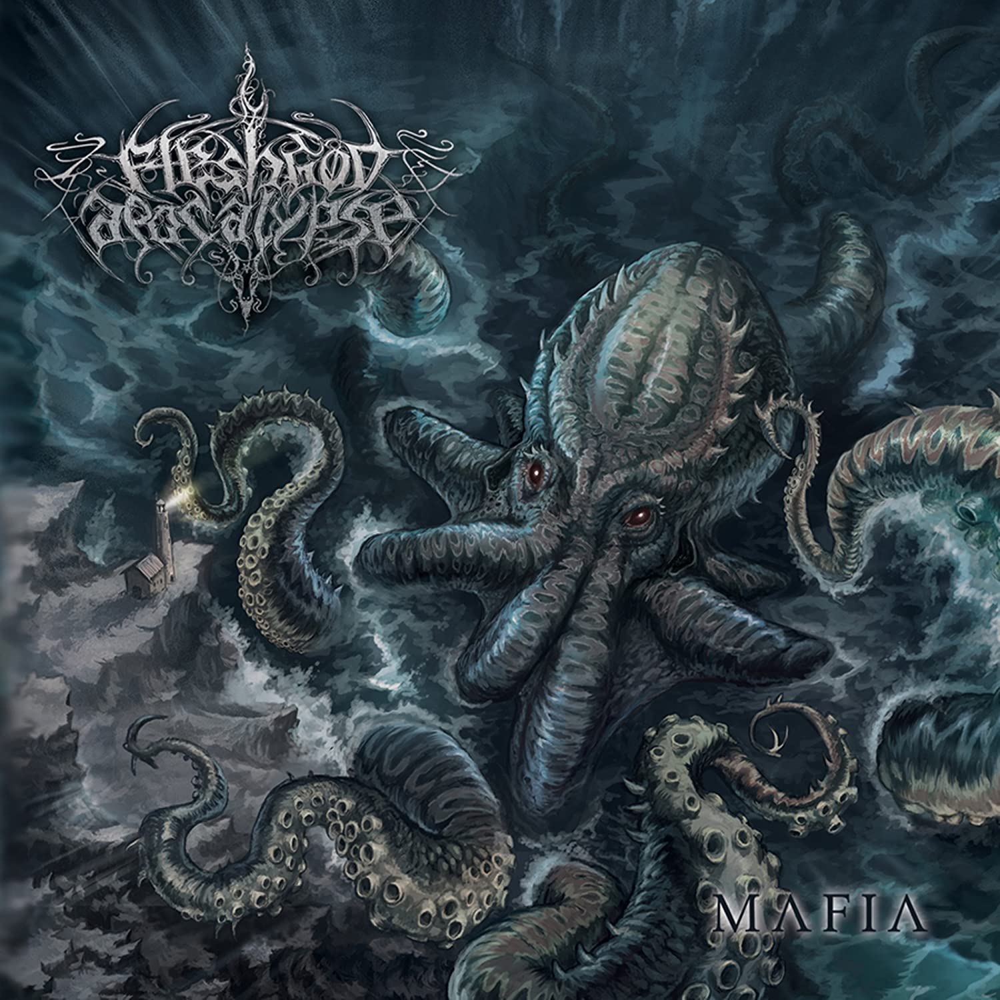

<h1 align="center">
   
  Kafka Connect Flask
   
</h1>

<h4 align="center">A Minimal Flask Webapp for Kafka Connect</h4>

  <a href="#key-features">Key Features</a> •
  <a href="#credits">To do</a> •
  <a href="#license">License</a>

## Key Features

* Minimal Web Interface
* Basic Kconnect management with no need of 3th party tools or Kconnect REST
* Fully portable thanks to docker

## To do

* Implement a route to edit the connector's config
* Implement a route to push a new connector's config
* Volume implementation for db

## License

MIT

---

> GitHub [@cryptoshepherd](https://github.com/) &nbsp;&middot;&nbsp;
> Twitter [@the_lello](https://twitter.com/)

